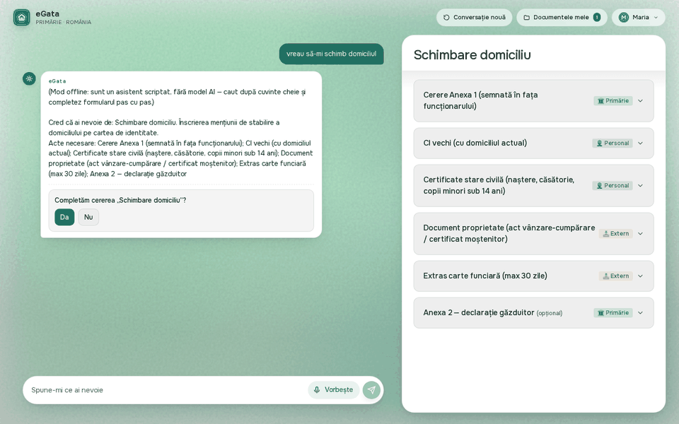
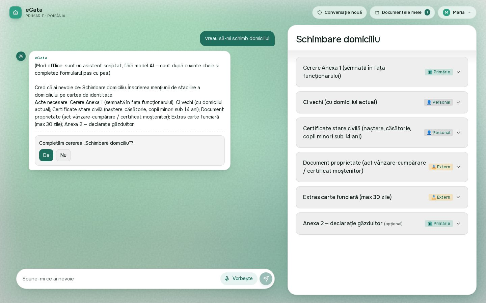
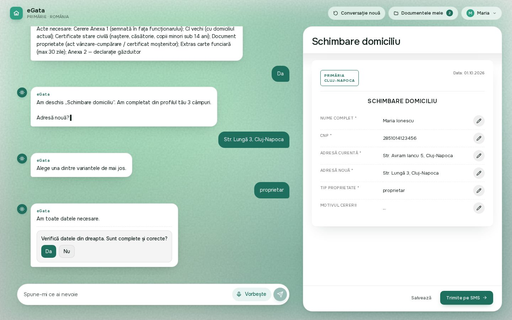
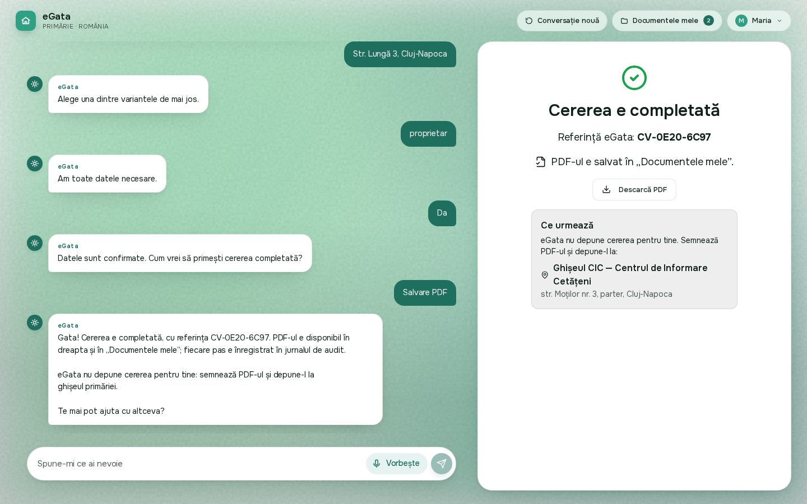
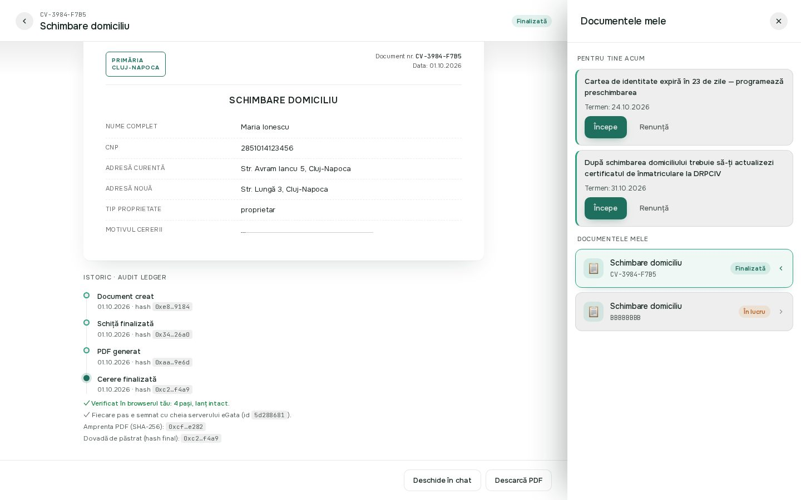
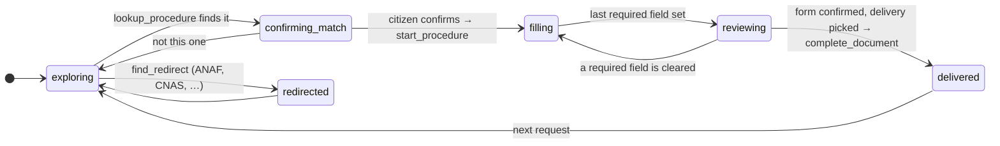
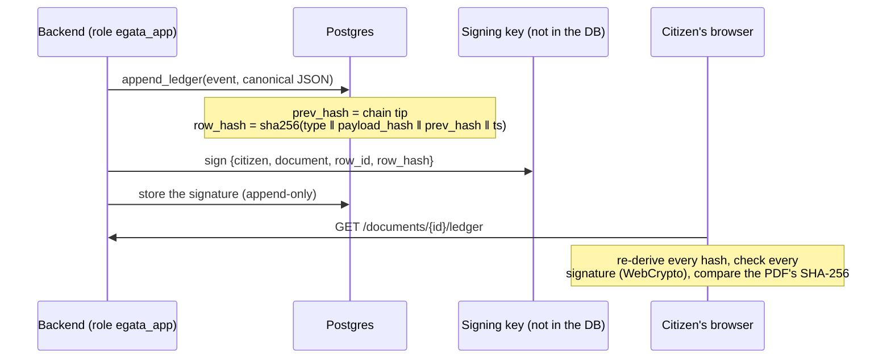
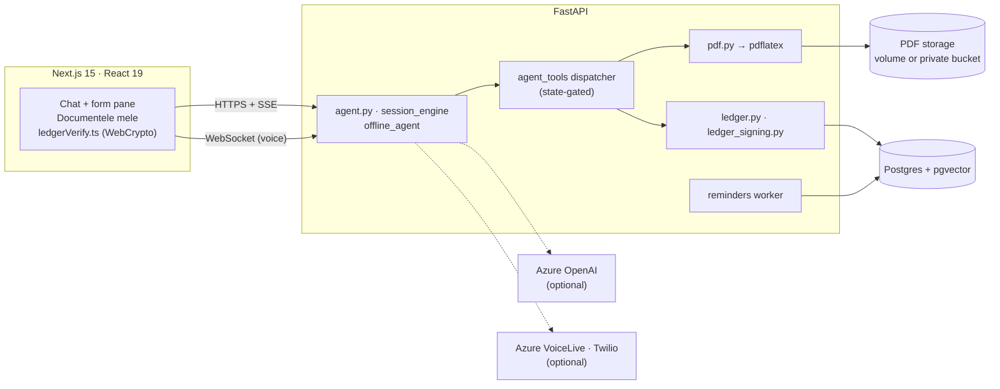

# eGata

**Conversational AI agent for Romanian primărie (city-hall) procedures.**
Built at Cluj Hackathon 2026 (Bosch Cluj, May 22–24), hardened since.

> Spune-i ce ai nevoie. Îți spune ce acte îți trebuie. Le și completează cu tine.



A citizen describes what they need in plain Romanian, by text or voice. eGata
finds the procedure, fills in what the citizen's profile already says, asks
only for what is missing, renders the official form to PDF with LaTeX, and
records every step in a signed, hash-chained ledger that the citizen's own
browser re-verifies. It does **not** file anything with the primărie: the
citizen signs the PDF and takes it to the ghișeu, and the app says so.
What is real and what is demo-only is listed [below](#whats-demo-only).

**Hosted demo:** <https://cluj-hackathon.vercel.app>. Its API server is down
(October 2026) and the page says so. The whole app runs locally in one
command, with no API keys.

---

## Run it in 2 minutes

```bash
git clone https://github.com/Bogzx/eGata && cd eGata
docker compose up --build      # Postgres + pgvector, migrations, backend, frontend
```

Open <http://localhost:3000>; it sends you to the login page. Pick persona
**Maria Ionescu** → **Login cu ROeID** → code `123456`. The chat opens; type
*vreau să-mi schimb domiciliul*:

1. confirm the procedure it found;
2. type the new address it asks for, pick *proprietar*;
3. confirm the filled form, choose *Salvare PDF*;
4. open **Documentele mele** → the document: its history, re-derived and
   signature-checked by your browser, with the PDF's SHA-256.

With no key, the chat is answered by the **offline agent**: a deterministic
script, not an LLM, and its first message says so. It drives the same tools,
state machine, PDF pipeline and ledger as the LLM agent. Put `AZURE_OPENAI_*`
in a `.env` and the LLM takes over ([how](docs/REFERENCE.md#turning-the-llm-on)).

This exact walk-through is [`frontend/e2e/flow.spec.ts`](frontend/e2e/flow.spec.ts):
CI runs it on every pull request against the same keyless stack, and the
pictures on this page come from it.

| The procedure is found, with the documents it needs | Only what is missing is asked; the form fills in on the right |
|---|---|
|  |  |
| **Done: the reference, the PDF, and where to file it** | **The audit trail, verified in the citizen's browser** |
|  |  |

---

## The model proposes, code decides

The agent is a state machine (`backend/app/sessions.py`). In each state the
model is offered only the tools that state permits
(`session_engine._tools_for_state`), and the dispatcher
(`backend/app/agent_tools/__init__.py`) refuses anything else whatever the
model says. The model chooses words and arguments. It does not choose what
it is allowed to do.

The main transitions (the full table is `_TRANSITIONS` in `sessions.py`):



| tool | exploring | confirming_match | filling | reviewing | delivered | redirected |
|---|:-:|:-:|:-:|:-:|:-:|:-:|
| `lookup_procedure`, `list_procedures`, `find_redirect` | ✓ | ✓ | | | ✓ | ✓ |
| `start_procedure` | | ✓ | | | ✓ | |
| `propose_widget` | | ✓ | ✓ | ✓ | | |
| `set_field` | | | ✓ | ✓ | | |
| `complete_document` | | | | ✓ | | |

### What the model cannot do

[`backend/tests/test_agent_guardrails.py`](backend/tests/test_agent_guardrails.py)
replaces Azure OpenAI with a scripted model that makes these calls, runs them
through the real engine, dispatcher and tools, and patches every function
that writes (documents, ledger, PDF, storage, SMS) to fail the test if it is
reached.

| A model that tries to… | is stopped by | tested in |
|---|---|---|
| deliver a document it never filled, or skip the review | `complete_document` exists only in `reviewing` | `test_agent_guardrails.py` |
| call a tool it was not offered | the dispatcher checks the state on every call | `test_agent_guardrails.py` |
| call a tool that does not exist | refused like an out-of-state call; the turn goes on | `test_agent_guardrails.py` |
| ask how to deliver before the citizen confirmed the form | review gate on the session row (`propose_widget`) | `test_agent_guardrails.py` |
| deliver on a choice it made itself | `complete_document` delivers only the option the citizen's own message names (clicked or typed), and never in the turn that asks | `test_agent_guardrails.py` |
| drop a half-filled form for another procedure or institution | `lookup_procedure` / `find_redirect` are off in `filling` / `reviewing` | `test_agent_guardrails.py` |
| change a delivered document | finalized documents are frozen (409; `set_field` off after delivery) | `test_document_guards.py`, `test_agent_guardrails.py` |
| act on another citizen's conversation or document | ownership is checked at the endpoint, before the model runs | `test_conversation_ownership.py` |
| write a document over the phone | `twilio_bridge.run_phone_tool` refuses every tool but `lookup_procedure` / `find_redirect` before the dispatcher | `test_agent_guardrails.py` |
| smuggle LaTeX into the PDF | every value escaped; `pdflatex -no-shell-escape`, `openin_any=p` | `test_pdf.py`, `test_template_rendering.py` |

## A ledger the citizen can check

Every milestone (document created, draft complete, PDF generated with its
SHA-256, delivered) is appended by a Postgres function that computes the
hashes itself. The backend's database role cannot write the table any other
way, and each row's chain head is Ed25519-signed with a key kept outside the
database.



The same check runs outside the browser:
`python backend/scripts/verify_ledger.py` (standard library only; it can also
keep a signed receipt that later proves a rewrite). It is tamper-**evident**,
not tamper-proof: the limits are spelled out [below](#whats-demo-only).

---

## What's in the box

This is a three-day hackathon build. The table below is triaged honestly:

- **shipped** — works, tested, runs offline from `docker compose up`.
- **partial** — works, with a caveat named in the row.
- **demo-only** — real code, but standing in for something that would have to
  exist before anyone could use this for real. See
  [What's demo-only](#whats-demo-only).

| Capability | Status | |
|---|---|---|
| 23 primărie procedures — field schemas, LaTeX templates, conditional logic | shipped | |
| 5 multi-step real-life scenarios (e.g. *cumpărare apartament*) | shipped | |
| 17 external institutions catalog (ANAF, CNAS, DRPCIV, SPCLEP-MAI, …) | shipped | |
| LaTeX → `pdflatex` → PDF pipeline, all 23 templates rendered in CI | shipped | |
| Hash-chain ledger (sha256), append-only, per-document chains that bind the PDF's hash; verifiable off-server with `scripts/verify_ledger.py` | shipped | tamper-evident, not tamper-proof — see below |
| Background worker — `next_steps[]` → reminders with `applies_if` filtering | shipped | |
| Accessibility: simple-language, voice-only, large-text, kiosk modes | shipped | |
| Stateful agent, 6-state machine with state-gated tool dispatch | shipped | |
| Romanian text chat — **offline agent** | shipped | no key needed; a deterministic script (keyword search, then field by field), not an LLM — it says so |
| Romanian text chat — LLM agent (Azure OpenAI) | partial | needs a paid Azure OpenAI key |
| Procedure search via pgvector (768-d) | shipped | local lexical index built automatically; the Azure embedding index needs a paid deployment |
| Azure VoiceLive browser WebSocket bridge (PCM16, streaming partials) | partial | needs a separate Azure VoiceLive resource |
| Twilio Media Streams ↔ VoiceLive phone bridge (μ-law 8 kHz) | partial | needs Twilio + a public tunnel; the audio path is not exercised by tests (the signature check and the tool allowlist are) |
| Delivery mode **send** (Twilio SMS) | partial | needs Twilio credentials; `save`/`print` work offline |
| MRZ scanner via tesseract.js (camera / upload / manual) | partial | parses the MRZ, then looks the CNP up in the seed table |
| ROeID login | demo-only | there is no ROeID integration; it maps a persona name to a seeded citizen |
| OTP login with `MOCK_OTP=1` | demo-only | accepts the literal `123456`; off by default in code |
| `POST /demo/reset`, three pre-seeded personas | demo-only | |
| MSW frontend mocks | partial | cover the REST surface, **not** `/agent/chat/stream` |
| Row-level security policies | demo-only | defined, but keyed on Supabase's `auth.uid()`; the backend's role `egata_app` has an allow-all policy, and authorization is in the application (below) |

---

## What's demo-only

Naming these plainly, because each one looks finished from the outside and is
not. None of them is hidden — they are all one grep away — but a reader
shouldn't have to grep.

**There is no ROeID integration.** `POST /auth/login-roeid` takes a persona
name (`maria-ionescu`, `andrei-popa`, `elena-dumitru`), looks up a hardcoded
CNP in `backend/app/auth.py`, and finds the matching seeded citizen. A real
integration would be an OAuth flow against the ROeID broker. The MRZ path
(`POST /auth/login-mrz`) does genuinely parse the machine-readable zone
client-side, but then it, too, only matches against the three seeded rows.

**`MOCK_OTP=1` is an authentication bypass.** It skips Twilio and accepts the
literal code `123456` for any challenge. It is **off by default in code** —
`docker compose` turns it on explicitly for the demo stack, and a deployment
that forgets the variable fails closed rather than open.

**There is no citizen registry.** Everything runs against three citizens
seeded by `migrations/002_seed_data.sql`. There is no sign-up, no identity
proofing, no way to add a fourth person short of writing SQL.

**Nothing is submitted anywhere.** "Delivery" means the PDF is stored and a
reference of the form `CV-XXXX-XXXX` is generated from the document UUID.
No primărie receives anything; the reference is not a registration number.
The done screen says so and tells the citizen where to file the form.

**Row-level security is decorative.** `migrations/004_rls_policies.sql`
defines per-citizen policies keyed on Supabase's `auth.uid()`, which is NULL
for a backend connection. The backend's role (`egata_app`, or the owner on
older setups) passes them through: `migrations/014` gives `egata_app` an
explicit allow-all policy. Authorization is application-level
(`_require_owner` in `backend/app/documents.py`, the conversation checks in
`backend/app/agent.py`). The policies would start mattering the day a client
talked to the database directly, which nothing does. What the database
itself *does* enforce for `egata_app` is the ledger: SELECT only, appends
only through `append_ledger()`.

**The PDF is not digitally signed.** No key signs it; there is no PAdES /
eIDAS signature and no seal a third party could validate. What exists: the
PDF is served through short-lived HMAC-signed (local) or Supabase-signed
*links*, and the ledger records the SHA-256 of the exact bytes stored, so a
PDF swapped in storage afterwards no longer matches its ledger row. A
qualified signature is on the roadmap and needs a trust-service provider.

**The ledger is tamper-evident, not tamper-proof.** What holds:

- Rows are hash-chained, and each is **Ed25519-signed** with a key kept
  outside the database. Someone who can write to Postgres but does not hold
  the key cannot produce a rewritten chain that verifies against the
  published public key.
- The backend's own role cannot INSERT into, change or truncate the ledger,
  or drop its triggers. It appends only through `append_ledger()`.
- A citizen can verify everything independently (`verify_ledger.py`, or the
  documents drawer in the browser) and keep a **signed receipt** of the
  current head (`--save-receipt`). If a later export no longer contains that
  head, the receipt proves the rewrite, and the operator cannot deny having
  signed it.

What doesn't hold:

- Whoever holds the **signing key** (the operator) can still rebuild and
  re-sign history. Only citizens holding earlier receipts would notice.
- Cutting rows off the end of a chain is invisible without a receipt.
- There is no external anchor. Periodically timestamping chain heads with an
  RFC 3161 TSA, or publishing them somewhere the operator doesn't control, is
  the recommended next step.
- The database owner or a superuser can still bypass everything at the SQL
  level. The point is that the application and its credential cannot. That
  includes `ledger_legacy_watermark` (`migrations/016`): an owner who raises
  it gets the backend to sign rows up to the new mark at its next start.
  Once an upgraded deployment has signed its history, nothing below the
  mark is unsigned, so this only matters for rows the owner appends.

**The reminders worker runs in-process, but is replica-safe.** `APScheduler`
runs inside each FastAPI process. Each tick takes a Postgres advisory lock,
so with several replicas only one works through the pending events and the
others skip that tick. Conversation turns are serialized the same way, with
a per-conversation advisory lock held for the turn. The review gate ("the
citizen confirmed the form") lives on the session row. Nothing that has to
be consistent across replicas is kept in process memory any more.
`DISTRIBUTED_LOCKS=0` falls back to in-process locks (unit tests).

---

## Architecture



## Repository layout

```
backend/
  app/                 FastAPI routers, agent engine, tools, ledger, pdf, voice bridges
  migrations/          001…016 SQL migrations (schema, RLS, ledger function and signatures, sessions, RAG)
  procedures/          23 JSON procedure definitions (fields, templates, next_steps)
  scenarios/           5 multi-step real-life scenarios (in-scope + external steps)
  institutions/        17 external-institution definitions (ANAF, ANEVAR, …)
  templates/           LaTeX templates (.tex) + base.tex + assets/
  scripts/             bootstrap_local_db, index_rag, verify_ledger, export_openapi, …
  tests/               pytest (state machine, guardrails, ledger, storage, PDF, end to end)

frontend/
  app/                 Next.js App Router (/, /login, /home, /req, /doc, /p, /r)
  components/          ChatSurface, RightPane, widgets/, MrzScanner, KioskShell, …
  lib/                 api.ts, sseChat, voiceWs, ledgerVerify, sessionStore, …
  mocks/               MSW handlers + fixtures (offline-capable frontend)
  e2e/                 Playwright: the full flow + smoke tests

contracts/openapi.yaml OpenAPI 3.1 spec exported from FastAPI
docs/REFERENCE.md      Everything else: features, API, configuration, tests, operations
docs/screenshots/      The pictures on this page (from the e2e run)
docs/superpowers/      Design specs and implementation plans from the hackathon
docs/hackathon/        The participant guide and the team's notes from the event
docs/archive/          Superseded docs from the Gemini-era architecture
primarii-app-data/     Source data the procedure catalogue was built from
```

## Tests

```bash
cd backend  && pytest            # offline: no database, no pdflatex, no keys
cd frontend && npm run test      # Vitest
cd frontend && npm run e2e       # Playwright, against a running stack
```

CI (`.github/workflows/ci.yml`) runs, on every pull request: ruff, strict mypy
and pytest; the ledger, document-API and offline-agent suites against a real
Postgres; `tsc` and Vitest; all 23 templates through real `pdflatex`; and
Playwright against `docker compose up` with no keys. Details and the opt-in
suites: [docs/REFERENCE.md](docs/REFERENCE.md#running-tests).

## More

- [docs/REFERENCE.md](docs/REFERENCE.md): feature surface, the HTTP/WebSocket
  API, demo personas, tech stack, environment variables, Docker compose and
  upgrading, roadmap
- `docs/superpowers/specs/2026-05-23-egata-design.md`: the original product and
  architecture spec
- `backend/RUNBOOK.md`: Supabase setup, Railway deploy, demo checklist

## License

MIT, see [LICENSE](LICENSE).
